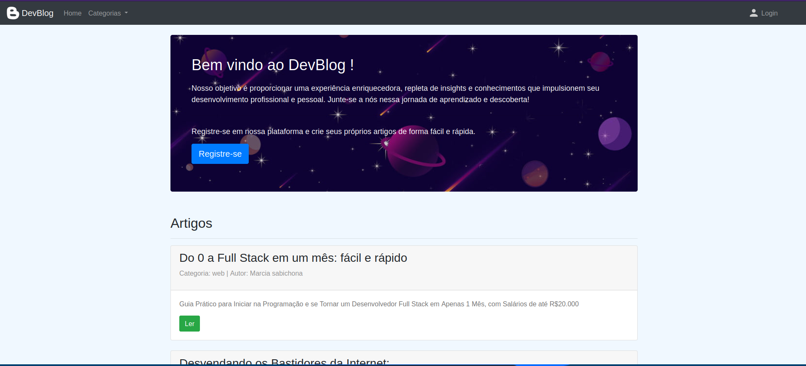

# DEV_BLOG

Um website para um blog interativo onde os usuários podem criar e ler artigos de forma fácil e prática, desenvolvido com a linguagem JavaScript.




## Recursos Utilizados:

Front-end:
- JavaScript
- HTML
- CSS
- Bootstrap
- TinyMCE

Back-end:
- Node.js
- Express
- EJS
- Sequelize
- MySQL

## Rodando a Aplicação:

### Dependências:

- Ter o Node.js instalado
- Ter um banco de dados MySQL rodando
- Criar um arquivo `.env` com as credenciais de acesso ao banco de dados seguindo o exemplo do arquivo `.env_example`
- Docker (opcional)

### Executando a Aplicação com Docker:

```
docker-compose build
docker-compose up
```

### Executando a Aplicação sem Docker:

#### Baixar Dependências:

```
npm install
```

#### Criar Tabelas no Banco de Dados:
Com o banco de dados rodando, execute:

```
node src/database/syncDb.js
```

#### Rodando a Aplicação:

```
npm start
```

### Acessando a Aplicação no Navegador:

```
localhost:3000
```
